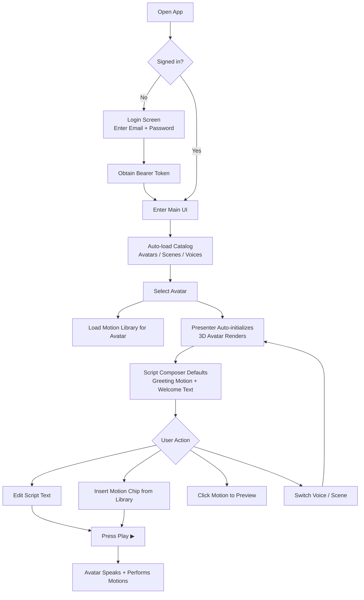

# Perxona Connect Kit — Tools

Web UI for previewing and controlling Perxona avatars via the Connect API and `<sv-presenter>` web component.

## Tech Stack

- **React 19** + TypeScript 6 + Vite 8
- **TanStack Query v5** for data fetching
- **Tailwind CSS 3** + shadcn/ui primitives
- **Presenter SDK** (`<sv-presenter>` custom element, loaded from CDN)

## Getting Started

Requires **Node `>=22`** — check with `node --version`. You'll also need a Perxona Connect account to sign in; if you
don't have one yet, see [Getting a Connect account](../../samples/express/README.md#getting-a-connect-account) for
the sign-up steps.

```bash
pnpm install
cp .env.example .env
pnpm dev
```

### Environment Variables

Create `.env` from the included production template:

```bash
cp .env.example .env
```

The template contains only the production API and presenter CDN settings:

```env
VITE_PERXONA_API_BASE_URL=https://console.perxona.ai/asia
VITE_PRESENTER_URL=https://cdn.perxona.ai/asia/prod/latest/widget/entry/presenter.js
```

Run `cp .env.example .env` again whenever you want to recreate the local
configuration. Edit `.env` only when using a different Perxona region or a
custom presenter CDN. The `.env` file is ignored by Git; do not commit it.

| Variable                    | Purpose                                   |
| --------------------------- | ----------------------------------------- |
| `VITE_PERXONA_API_BASE_URL` | Base URL for the Perxona Connect REST API |
| `VITE_PRESENTER_URL`        | CDN URL for the presenter engine script   |

## Project Structure

```text
src/
├── App.tsx                    # Auth gate + main layout
├── components/custom/         # App-specific UI components
│   ├── app-header.tsx         # Top bar with account dropdown
│   ├── login-screen.tsx       # Sign-in form
│   ├── motion-library.tsx     # Motion grid with search/filter
│   ├── preset-avatar-select.tsx # Horizontal avatar picker
│   ├── scene-select.tsx       # Scene thumbnail selector
│   └── script-composer.tsx    # Rich-text editor with motion chips
├── components/ui/             # shadcn/ui primitives
├── hooks/
│   ├── use-auth.ts            # Auth state (login/logout/token)
│   ├── use-avatar-session.ts  # Presenter lifecycle (launch/speak/playMotion)
│   ├── use-catalog.ts         # Avatars, voices, scenes queries
│   ├── use-motions.ts         # Motion list per avatar
│   └── use-presenter.ts       # Imperative <sv-presenter> handle
├── lib/
│   ├── api.ts                 # REST client with auto-401 logout
│   ├── auth.ts                # Token store (memory + sessionStorage)
│   └── presenter.ts           # CDN script loader
└── styles/tokens.css          # Design tokens
```

## Features

- **Avatar Preview** — Full-screen 3D avatar rendering with real-time character switching
- **Speech Synthesis** — Type text and press Play; the avatar speaks with lip-sync
- **Motion Library** — Browse, search, and filter motions; click to preview, copy Motion ID
- **Script Composer** — Rich-text editor mixing free text with Motion chip tags; avatar performs them in sequence
- **Scene & Voice Switching** — Bottom control bar for instant scene/voice changes
- **Motion Tag Insertion** — "+" button inserts a motion into the script for timed playback
- **Auto-launch** — Presenter initializes automatically when avatar/scene/voice is selected
- **Session Management** — Token stored in sessionStorage; cleared when the tab closes

## User Flow



### Step-by-Step

1. **Sign in** — Enter your Perxona account credentials to obtain a Connect API token
2. **Select Avatar** — Pick a character from the horizontal list; presenter auto-initializes
3. **Select Voice / Scene** — Use the bottom control bar to switch voice style and background
4. **Write Script** — Type what you want the avatar to say in the Script Composer
5. **Insert Motion** — Find a motion in the library, press "+" to add it to the script (or click to preview)
6. **Play** — Press the Play button; the avatar speaks and performs motions in sequence
7. **Sign out** — Top-right account dropdown → Sign out

## Key Flows

**Auth:** Email/password → `POST /api/v1/connect/auth/login` → bearer token stored in `sessionStorage` (never the password).

**Presenter:** Fetch Connect token → `presenter.initialize(token, {avatarId, sceneId, voiceId})` →
`presenter.present(text)` for speech + lip-sync.

**Motions:** Click a motion block to preview it (`playMotion`). Use the "+" button to insert it into the Script Composer.

## Scripts

| Command        | Description                   |
| -------------- | ----------------------------- |
| `pnpm dev`     | Start local dev server        |
| `pnpm build`   | Type-check + production build |
| `pnpm lint`    | Run ESLint                    |
| `pnpm preview` | Preview production build      |

## Troubleshooting

For Presenter SDK issues not specific to this tool, see [Presenter SDK Integration
FAQs](../../README.md#presenter-sdk-integration-faqs) in the repo root README.
